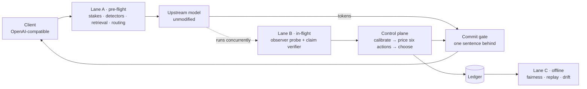

<div align="center">
  
  <h3>Routing and guarding are the same decision.</h3>
  <p><em>Estimate what a request is worth once, then spend both the compute budget and the checking budget out of that one number.</em></p>

[](https://github.com/skb12356/Interlock-AI/actions/workflows/ci.yml)
[](docs/ARCHITECTURE.md)
[](artifacts/)
[](docs/LIMITATIONS.md)

</div>

---

## Contents

[The problem](#the-problem) · [The solution](#the-solution) · [What it looks like](#what-it-looks-like) ·
[How one request travels](#how-one-request-travels) · [The ladder (L0–L5)](#the-ladder-l0l5) ·
[The maths](#the-maths-surface-level) · [Results](#results) · [Run it](#run-it) ·
[Repository map](#repository-map) · [Documentation](#documentation) · [Demo video](#demo-video) ·
[Research foundations](#research-foundations) · [What is ours](#what-is-ours) ·
[Known limitations](#known-limitations)

---

## The problem

A bank puts an AI assistant in front of customers. Most of what it is asked is harmless —
branch timings, balances, how to reset a card. A few things are not: an invented penalty
clause, a settlement date no document supports, an email that should never have been sent.

Both kinds arrive through the same endpoint, and you cannot tell which is which until the
answer already exists. Today, teams respond by building two separate systems:

- a **router**, which asks *how much compute does this deserve?* — and optimises cost;
- a **guardrail**, which asks *how hard should I check this?* — and optimises safety.

They are tuned separately, budgeted separately, and argue with each other. The guardrail is
a pure cost line, so it gets cut. And because checking usually runs *after* generation, the
customer waits for it, which is the other reason it gets switched off.

There is a third failure that neither system addresses: **a guardrail that emits a score
does not make a decision.** "Groundedness 0.72" hands a human a threshold file. Somebody
picks 0.7, everything above it is blocked, half the blocks are wrong, and in week two the
whole thing is disabled.

## The solution

Both questions above are the same question — *how much does this request matter?* — so
Interlock computes it **once**, as an amount of money, and spends both budgets from it.

Interlock is an **OpenAI-compatible streaming proxy**. A client points `base_url` at it and
changes nothing else; the model behind it is unmodified and never sees Interlock. Around
every request it runs three lanes:

- **Lane A (pre-flight)** — injection, PII and canary checks, retrieval, the stakes
  estimate, the semantic cache, and the model routing decision.
- **Lane B (in-flight)** — a small observer model with linear probes, plus claim-level
  grounding, running **concurrently with generation** behind a one-sentence commit buffer.
  The reader is always looking at sentence *n* while sentence *n+1* is checked.
- **Lane C (offline)** — fairness twins, shadow replay, a ~1% deep-judge calibration
  anchor, drift tests. Never on the critical path.

Every calibrated signal is converted into **expected loss in rupees**, all six possible
responses are priced, and the cheapest safe one is chosen. Money saved by not over-routing
the cheap 80% pays for deep checking on the expensive 20%, so oversight funds itself instead
of being a tax.

The headline metric is the **Pre-Action Catch Rate**: the share of defects stopped *before*
a person read them or a tool acted on them. It measures the whole control path, not model
accuracy.

## What it looks like

The console is where a request becomes legible. Ask a question like any assistant:


Every answer carries the stages that produced it, and **see it live** opens the full trace.
Stage 04 prices all six actions and keeps the losers on screen, because the point is not
which rung won but *why*:


Stage 06 shows what the customer actually saw, the stamp for what was done to it, and what
would have shipped without Interlock:


Holds wait for a human, with the evidence and the flagged span attached, and a link back to
the conversation that caused them:


The evidence ledger reads committed artifacts — including the target it currently misses:


<details>
<summary>More screenshots</summary>


</details>

## How one request travels



1. **Estimate the stakes** from domain, the largest amount in the text, and who is asking.
2. **Run the cheap deterministic checks**: injection, PII, canary.
3. **Route** on stakes first, difficulty second — before paying any model.
4. **Generate**, streaming one sentence behind so a bad sentence can still be repaired.
5. **Check while generating**: observer probe plus claim-level grounding.
6. **Calibrate** raw scores into probabilities, then **price all six actions** in rupees.
7. **Act**: pass, annotate, repair, reroute, hold or block — cheapest safe rung wins.
8. **Record** the decision, evidence, spend and latency; sample offline checks afterwards.

> **Full detail, with every formula and its source: [docs/ARCHITECTURE.md](docs/ARCHITECTURE.md)**

## The ladder (L0–L5)

Blocking everything suspicious makes an assistant useless; blocking nothing makes it
dangerous. So there are six rungs, and each one is **priced before one is chosen**.

| Rung | What it does | What it costs | When it wins |
|---|---|---|---|
| **L0 · Pass** | Release the sentence unchanged. | 0 ms | Calibrated risk is low. Most traffic ends here. |
| **L1 · Annotate** | Add a citation, hedge or flag — deterministic text, no regeneration. | ~0 ms | Mild uncertainty: the reader should know which part to check. |
| **L2 · Repair** | Regenerate **only the defective sentence**, with the evidence attached. | 13.7 s measured median | One localized factual defect, and the verifier returned the offending span. |
| **L3 · Reroute** | Regenerate on the stronger tier, re-retrieving first. | 30.7 s measured median | The weak model or the retrieval was the problem, not one sentence. |
| **L4 · Hold** | Freeze into a durable pending state and wait for a human. | ₹220 reviewer cost, SLA-bound | Irreversible action, or a cost of being wrong that exceeds a person's time. |
| **L5 · Block** | Emit no unsafe content at all. | ₹220, and the interaction is lost | A deterministic rule fired — a canary token, or an injected instruction driving an irreversible action. **No model is in this loop.** |

Two properties matter more than the list:

- **The ladder shrinks as the answer travels.** Before anything is sent, every rung is
  available. Once a sentence has reached the reader, L2, L3 and L5 are gone — you cannot
  un-say something, and the loss table says so explicitly instead of pretending.
- **Hard rules run before the arithmetic.** A canary match or a tool-policy violation
  short-circuits to L4/L5; the optimiser then picks the cheapest action among what is left.

L2 and L3 medians are measured on `qwen3:8b` via Ollama, 3 runs each
([`artifacts/action_latency.json`](artifacts/action_latency.json)) — the ladder prices those
real latencies, which is why L3 rarely wins on cheap traffic.

## The maths (surface level)

Enough to follow the decision. Each block names the published work it comes from; the full
derivations are in [docs/ARCHITECTURE.md](docs/ARCHITECTURE.md).

### 1. What is this request worth?

```
impact_inr = base_impact(domain) × monetary_multiplier(largest ₹ amount) × role_multiplier
```

carried with `reversibility ∈ {reversible ×1.0, costly ×2.5, irreversible ×8.0}`. A branch
timing is ₹50. A payment question is ₹25,000 and irreversible. Every number is in
[`policies/banking.yaml`](policies/banking.yaml) — a reviewed file, not a constant in code.

### 2. How suspicious is the answer?

Six deterministic grounding signals (unsupported content, unsupported numbers, unsupported
citations, context conflict, question drift, overconfidence) plus a linear probe on an
observer model's residual stream:

```
probe score = σ(wᵀ h_ℓ + b)      — one forward pass, one probe per layer, layer chosen on held-out AUROC
```

*Source:* semantic entropy is the strongest published hallucination signal but needs ~10
samples per question (Farquhar et al., *Nature* 630, 2024, "Detecting hallucinations… using
semantic entropy"), so it is used **offline as a label generator only**. The deployable form
is the single-pass probe of Kossen et al. (arXiv:2406.15927, §3, "Semantic Entropy Probes"),
and running that probe on a **different** model from the generator is what keeps Interlock
model-agnostic (O'Neill et al., arXiv:2507.23221).

Claim-level grounding uses a MiniCheck-class verifier (Tang, Laban & Durrett, EMNLP 2024) —
a 770M model reaching GPT-4-level fact-checking cheaply — and, crucially, it returns **the
offending span**, which is what L2 repair aims at.

### 3. Turning a score into a probability

A raw score is not a probability, and pricing in rupees with an uncalibrated score is
arithmetic that only looks rigorous. Two steps:

```
per signal:   g(s) = isotonic fit,  minimising Σ (g(sᵢ) − yᵢ)²  subject to monotonicity
fused:        P(defect) = σ( β₀ + Σ_k β_k · g_k(s_k) )
across defects: P(any) = 1 − Π_d (1 − P(d))
```

Fitted with 5-fold stratified CV; **every reported number is out-of-fold**, because fitting
and scoring on the same data drives calibration error to zero no matter how bad the model is.

*Source:* Zadrozny & Elkan (2002), "Transforming Classifier Scores into Accurate Multiclass
Probability Estimates" — the isotonic step is §3 of that paper.

### 4. Choosing the action

```
E[L(a)] =  Σ_d P(d) · Impact_d · (1 − eff[a][d])     (1) harm that survives the action
        +  (1 − P(any)) · Nuisance(a)                (2) the cost of a false alarm
        +  tokens(a) · price + human_cost(a)         (3) compute, and a reviewer's time
        +  λ_time · Δlatency(a) / 1000               (4) the customer's waiting, priced

Impact_d = impact_inr × defect_multiplier[d] × reversibility_multiplier
```

with `λ_time = ₹0.40/s`, `price = ₹0.60 / 1k tokens`, `human_review = ₹220`. Choose
`argmin_a E[L(a)]` over the actions that are still available.

Term (2) is what stops over-blocking — and over-blocking is what gets guardrails switched
off. Human cost is charged unconditionally on L4 and L5: the reviewer is paid whether or not
the answer turns out to have been fine.

*Source:* the reject option in selective classification (Geifman & El-Yaniv, 2017,
"Selective Classification for Deep Neural Networks") — trade coverage against error instead
of answering everything. Interlock's addition is pricing that trade in money, and putting
"escalate to a stronger model" and "escalate to a human" on the same axis, as framed by
*Cascaded Language Models for Cost-Effective Human–AI Decision-Making* (NeurIPS 2025).

### 5. Turning a threshold into a promise

Sweeping thresholds and quoting the best one is multiple testing: the winner is partly
lucky, and the quoted rate is optimistic by an unstateable amount. Interlock selects the
threshold with **Learn-then-Test**: each candidate λ is a hypothesis, its p-value comes from
the **minimum of Hoeffding's and Bentkus's bounds** (Bentkus is far tighter in the rare-event
regime), and **fixed-sequence testing** walks thresholds from strictest to loosest, spending
no correction budget because the ordering itself carries information.

What comes out is a defensible sentence: *at most 1% ungrounded escapes, at 90% confidence,
on n = 840 held-out items.*

*Source:* Angelopoulos et al. (2022), "Conformal Risk Control" — distribution-free risk
control by threshold selection rather than eyeballing.

### 6. Watching fairness without crying wolf

Lane C compares counterfactual twins — the same request with protected attributes varied —
and monitors the disparity continuously. Continuous monitoring with ordinary significance
tests manufactures false alarms, so the monitor uses **e-values**, whose validity survives
optional stopping.

*Source:* Koolen & Grünwald (2022) on log-optimal anytime-valid e-values, and Henzinger et
al. (2023) on monitoring algorithmic fairness at runtime.

## Results

Every number below is read from a committed artifact and carries its denominator and
provenance. Together they test the system at four different layers: an independently judged
grounding set, repeatable policy simulations, statistical calibration, and the running
gateway under load.

### Evidence at a glance

| Evidence layer | Scale | Result | What it establishes |
|---|---:|---|---|
| **Human-reviewed external evaluation** | **300 examples** | 300/300 valid · **87.7%** binary agreement · **8.5%** clean false positives | The ground-truth label and GPT-4o Mini judgment for every example were manually verified item by item. |
| Three-seed policy evaluation | **600 decisions** | **100%** pre-action catch in every seed · zero policy misses · zero empirical ungrounded escapes | The safety result repeats across three immutable seeds instead of depending on one favourable run. |
| Bounded policy comparison | **216 candidates × 3 seeds** | Selected policy has no catch, escape, or reference-action regression | The shipped parameters came from an explicit, reproducible selection rule. |
| Out-of-fold calibration | **10,000 examples · 5 folds** | ECE **0.0037** · Brier **0.0207** · AUROC **0.909** | Raw detector scores become cost-sensitive probabilities without evaluating on their training fold. |
| Conformal risk control | **840 held-out examples** | Certified ≤1% ungrounded escapes at 90% confidence | The strongest safety claim has a statistical certificate, with its operating cost stated beside it. |
| Live gateway load pass | **4,023 requests · concurrency 20** | **4,023/4,023 succeeded** | The real gateway completed every request in the saved load run. |
| Strict integration rehearsal | **4 end-to-end scenarios** | Real SSE, ConsoleHub, decision projections, durable hold, and compiled console exercised | The console is backed by gateway events rather than display-only fixtures. |
| Automated security sweep | **5 controls** | **5/5 passed** | Default prompt privacy, tenant isolation, evidence redaction, secret exclusion, and policy validation are enforced. |
| Counterfactual fairness monitor | **5 twin pairs** | **5/5 received identical actions** | The offline Lane C path works; the sample is deliberately labelled preliminary. |

> [!IMPORTANT]
> “Human reviewed” describes the 300-example grounding audit, not production traffic. The
> exact reviewed inputs are bound to SHA-256 digests in
> [`manual_anchor_300.review.json`](artifacts/eval/manual_anchor_300.review.json), so changing a
> label or judgment invalidates the attestation and stops report generation.

### 1. Human-reviewed external evaluation

GPT-4o Mini independently judged 300 generated grounding examples through OpenRouter. The
project author then manually verified **both the ground-truth label and the model judgment
for every example**. The run produced 300/300 schema-valid judgments (95% CI 98.7–100%),
**79.0% strict three-class agreement** and **87.7% grounded-versus-defective agreement**.
On the 200 clean examples, the external judge marked 17 incorrectly — an **8.5% false-positive
rate** (95% CI 5.4–13.2%).

The difficult side is published too: the judge called 20 of 100 generated grounding failures
clean, a **20.0% grounding-escape rate** (95% CI 13.3–28.9%). This is a measurement of the
external judge against the reviewed offline taxonomy, not Interlock's stakes-aware product
action rate. Full confusion matrices, domain and challenge-level slices, failed examples,
token usage and latency live in
[`manual_anchor_report.json`](artifacts/eval/manual_anchor_report.json).

### 2. Safety repeats across seeds

The release policy was evaluated on three deterministic 200-case runs (seeds 20260826,
20260827 and 20260828), each containing 43 induced defects. All three runs caught **43/43
defects before a reader or tool acted**, recorded no policy miss, and measured zero empirical
ungrounded escapes. Across the 600 decisions the ladder selected 186 passes, 341 repairs,
6 durable holds and 67 blocks, exercising both permissive and intervention paths.

| Seed | Decisions | Pre-action catch | Policy misses | Empirical ungrounded escapes | Decision-path p95 |
|---:|---:|---:|---:|---:|---:|
| 20260826 | 200 | **43/43 (100%)** | **0** | **0/25** | 0.402 ms |
| 20260827 | 200 | **43/43 (100%)** | **0** | **0/25** | 0.424 ms |
| 20260828 | 200 | **43/43 (100%)** | **0** | **0/25** | 0.413 ms |

The seed artifacts are [`report-seed-20260826.json`](artifacts/eval/report-seed-20260826.json),
[`report-seed-20260827.json`](artifacts/eval/report-seed-20260827.json) and
[`report-seed-20260828.json`](artifacts/eval/report-seed-20260828.json). These are generated
seeded evaluations, not customer traffic; the per-seed confidence interval for 43/43 catch
is 91.8–100%.

The policy itself was selected from **216 bounded candidates** evaluated against all three
immutable seeds. Candidates were rejected if any seed regressed the ≥90% catch rule, created
a grounding escape, or changed the reference Hold/Repair/Pass contract. The selected
`banking-v4` candidate passed all three gates. The complete candidate matrix — including the
rejected alternatives — is in
[`policy_comparison.json`](artifacts/eval/policy_comparison.json).

### 3. Calibration and the certified operating mode

The six grounding signals were calibrated on 10,000 induced examples with 1,000 positives
using five-fold out-of-fold evaluation: **ECE 0.0037**, **Brier 0.0207**, **AUROC 0.909**.
Per-signal AUROC is published even where a signal is weak — `citation_unsupported` 0.600,
`context_conflict` 0.575, `question_drift` 0.536 and `overconfidence` 0.504 — because the
fusion layer's evidence should be inspectable rather than selectively reported.

The conformal mode is **certified at most 1% ungrounded escapes, at 90% confidence, on
n = 840 held-out examples**. It selected λ = 0.015 with measured escape rate 0.000 and
Learn-then-Test p-value 0.00059. That certificate has an explicit price: this threshold
checks **100% of traffic**. The next threshold (λ = 0.020) checks 6.7%, but its measured
escape rate is 19.9%, so the procedure correctly refuses to certify it. See
[`calibration/report.json`](artifacts/calibration/report.json) and
[`calibration/lambda.json`](artifacts/calibration/lambda.json).

### 4. The real gateway: reliability, integration and latency

The saved local load run sent **4,023 requests at concurrency 20 and completed all 4,023
without a transport failure**. Separately, the strict rehearsal drove four scenarios through
the real OpenAI-compatible gateway and verified streamed stakes and decisions, read-only
ConsoleHub projections, an initiating-stream-only resume token, a durable L4 hold, and an L5
hard-rule block. Evidence:
[`load_pass.json`](artifacts/load/load_pass.json) and
[`gateway_rehearsal.json`](artifacts/rehearsal/gateway_rehearsal.json).

Reliability is not relabelled as speed. The same load artifact records client p95 of 1.68 s
and gateway-overhead p95 of **531 ms**, which misses the 120 ms budget and includes 123.3 ms
of mean unattributed overhead. The small 0.40–0.42 ms figure above is only the isolated
decision calculation; the 531 ms figure is the relevant full-gateway engineering gap.

Measured generative actions are also explicit: `L2_repair` took **13.7 s** and `L3_reroute`
**30.7 s**, each the median of three runs on `qwen3:8b` via Ollama
([`action_latency.json`](artifacts/action_latency.json)).

### 5. Security, fairness and economics

The local automated security sweep passed all five checks: prompts are not stored by
default; tenant canaries remain tenant-bound; resume tokens and canaries are redacted from
evidence exports; configured secret files are untracked; and the versioned policy validates
against its strict schema. This is an automated sweep, **not an external penetration test**
([`security_sweep.json`](artifacts/security/security_sweep.json)).

Lane C evaluated five offline counterfactual pairs differing in one demographic marker.
All five received the same action, with zero observed disparity. Five pairs are below the
monitor's ten-sample warm-up, so the result is correctly **preliminary rather than a fairness
certificate** ([`fairness_run.json`](artifacts/eval/fairness_run.json)).

Across the three seeded runs, modelled verification cost was **5.18–5.60% of model spend**
and routing-only net spend change was **−15.8% to −17.8%**. These are policy-price models,
not observed provider billing; no cache saving, production regret, rework or net-value claim
is fabricated. That distinction is preserved in
[`product_report.json`](artifacts/eval/product_report.json).

Regenerate the evidence with `make eval`, `make calibrate`,
`uv run python scripts/report_manual_anchors.py`, and
`uv run python scripts/build_product_report.py`.

## Run it

Nothing below needs an API key.

**Console only** (deterministic replay gateway, no model, no index):

```bash
uv run python scripts/replay_console.py --port 8099
npm --prefix console run dev -- --host 127.0.0.1
```

Open <http://127.0.0.1:5173> and ask a question. The replay gateway picks a recorded trace
from the prompt text, so `prepayment` reaches an L2 repair, `forward … claim` an L4 hold,
`internal reference` an L5 canary block, and `branch … hours` a clean L0 pass.

**Full local stack** (Ollama, two model tiers, real retrieval):

```bash
ollama pull qwen3:4b && ollama pull qwen3:8b
uv run python scripts/build_index.py
make up        # gateway :8080 · observer :8081 · console :5173
```

**Point any OpenAI client at it:**

```python
from openai import OpenAI

client = OpenAI(base_url="http://127.0.0.1:8080/v1", api_key="not-needed")
stream = client.chat.completions.create(
    model="interlock",
    messages=[{"role": "user", "content": "What are the prepayment charges on my home loan?"}],
    stream=True,
)
```

The interlock events (`interlock.stakes`, `.signal`, `.decision`, `.hold`) arrive on the same
SSE stream alongside the standard OpenAI chunks.

Full setup, configuration and troubleshooting: [`docs/REFERENCE.md`](docs/REFERENCE.md) and
[`docs/05_deploy_runbook.md`](docs/05_deploy_runbook.md).

## Repository map

| Path | What lives there |
|---|---|
| `interlock/gateway/` | FastAPI proxy, Lane A, router, cache, console projections |
| `interlock/risk/` | expected-loss objective, calibration, conformal thresholds, risk engine |
| `interlock/signals/` | stakes model, grounding signals, injection, PII, canary |
| `interlock/observer/` | observer service, linear probes, MiniCheck-class verifier |
| `interlock/gate/` | sentence commit gate and the intervention ladder |
| `interlock/interlock_tools/` | provenance tracking and the tool-call interlock |
| `interlock/eval/` | seeded evaluation, induced defects, metrics, anchors |
| `console/` | React operator console (chat, trace, reviews, evidence, about) |
| `policies/` | versioned policy — the governance artefact |
| `artifacts/` | committed evidence: evaluation, calibration, latency |
| `corpus/` | 45-document banking corpus, including one poisoned and one benign-untrusted doc |
| `docs/` | architecture, runbook, limitations |

## Documentation

- **[docs/ARCHITECTURE.md](docs/ARCHITECTURE.md)** — the whole system in detail, with the
  maths and the paper each mechanism comes from.
- [docs/REFERENCE.md](docs/REFERENCE.md) — operator and developer reference: dependencies,
  every start-up path, the API surface, configuration, the test gate, security model and
  deployment shape.
- [docs/LIMITATIONS.md](docs/LIMITATIONS.md) — what this build does not do.
- [docs/05_deploy_runbook.md](docs/05_deploy_runbook.md) — running it.
- [IMPLEMENTATION_STATUS.md](IMPLEMENTATION_STATUS.md) — what is built, what is measured,
  what is stubbed, and every recorded deviation with its reason.
- [artifacts/](artifacts/) — the evidence behind every number above.
- [DeepWiki: skb12356/Interlock-AI](https://deepwiki.com/skb12356/Interlock-AI) — a
  browsable, question-answerable index of this repository. Generated by DeepWiki from the
  source rather than written by us, so read it as a map of the code, not as a claim about
  the system.

The screenshots in this file are regenerated from a live console against the replay gateway
with `node console/scripts/capture-screenshots.mjs` — none of them is a mock-up.

## Demo video

<!-- Replace with the recorded walkthrough before submission. -->
_TODO: add the demo video link._

## Research foundations

Almost every mechanism here is somebody else's published result, re-implemented and pointed
at this problem. The wording below distinguishes what is **implemented** from what is
**inspiration**.

| Research paper | Concept used | Where it appears in Interlock |
|---|---|---|
| [Retrieval-Augmented Generation for Knowledge-Intensive NLP Tasks](https://arxiv.org/abs/2005.11401), Lewis et al., 2020 | Combining model knowledge with retrieved external documents and preserving evidence provenance. | Retrieval pipeline, grounded answers, trusted/untrusted document handling. |
| [The Probabilistic Relevance Framework: BM25 and Beyond](https://doi.org/10.1561/1500000019), Robertson & Zaragoza, 2009 | BM25-style probabilistic lexical retrieval. | `interlock/retrieval/` and the corpus search index. |
| [Detecting Hallucinations in Large Language Models Using Semantic Entropy](https://www.nature.com/articles/s41586-024-07421-0), Farquhar et al., 2024 | Measuring uncertainty over meaning rather than only token probabilities. | Inspiration for semantic uncertainty and hallucination detection. **The full multi-sample semantic-entropy method is not used on the hot path.** |
| [Semantic Entropy Probes: Robust and Cheap Hallucination Detection in LLMs](https://arxiv.org/abs/2406.15927), Kossen et al., 2024 | Approximating semantic uncertainty using a single hidden-state pass and a lightweight probe. | Observer model and residual-stream probe design. |
| [A Single Direction of Truth: An Observer Model's Linear Residual Probe Exposes and Steers Contextual Hallucinations](https://arxiv.org/abs/2507.23221), O'Neill et al., 2025 | A generator-independent observer can detect contextual hallucinations from its own residual activations. | Lane B observer, layer-wise linear probes, generator-agnostic monitoring. |
| [MiniCheck: Efficient Fact-Checking of LLMs on Grounding Documents](https://arxiv.org/abs/2404.10774), Tang, Laban & Durrett, 2024 | Lightweight claim-level grounding verification instead of expensive LLM judging for every claim. | MiniCheck-class claim verification, unsupported-claim detection, synthetic defect generation. |
| [Transforming Classifier Scores into Accurate Multiclass Probability Estimates](https://doi.org/10.1145/775047.775151), Zadrozny & Elkan, 2002 | Converting raw classifier scores into meaningful probabilities for cost-sensitive decisions. | Per-signal isotonic calibration, calibrated defect probabilities, risk-based action selection. |
| [Conformal Risk Control](https://arxiv.org/abs/2208.02814), Angelopoulos et al., 2022 | Choosing thresholds with statistical risk guarantees instead of tuning them by eye. | Conformal threshold selection and the ungrounded-escape guarantee in `interlock/risk/conformal.py`. |
| [Selective Classification for Deep Neural Networks](https://arxiv.org/abs/1705.08500), Geifman & El-Yaniv, 2017 | The reject option: trade prediction coverage against error risk. | Pass, annotate, repair, reroute, hold and block form a risk–coverage control ladder. |
| [Defeating Prompt Injections by Design](https://arxiv.org/abs/2503.18813), Debenedetti et al., 2025 | Separating trusted control flow from untrusted data flow and enforcing tool capabilities outside the language model. | Provenance tracking, reversibility-aware tool policies, deterministic tool-call holds/blocks. **Interlock uses a simplified heuristic rather than a CaMeL-complete interpreter.** |
| Monitoring Algorithmic Fairness, Henzinger et al., 2023 | Monitoring fairness properties continuously during system operation. | Lane C counterfactual fairness twins and decision-level disparity monitoring. |
| Log-optimal Anytime-valid E-values, Koolen & Grünwald, 2022 | Evidence measures that remain valid under sequential monitoring and optional stopping. | Anytime-valid e-value monitoring for Lane C fairness observations. |

> **Disclaimer.** Interlock is research-informed software. It adapts ideas from hallucination
> detection, retrieval, calibration, conformal risk control, selective prediction, fairness
> monitoring and secure agent design. The implementation is an engineering adaptation and
> does not claim to reproduce the guarantees or benchmark results of the cited papers.

## What is ours

The papers above support individual mechanisms. These are Interlock's own system
contributions rather than copied research results:

- **One stakes estimate shared by routing and guardrails** — the thesis of the whole build.
- **Expected-loss action selection in a common currency**, so "block, edit or escalate" is
  arithmetic a risk officer can review rather than an engineer's threshold.
- **The L0–L5 intervention ladder**, and the rule that it shrinks as the answer travels.
- **Cost, regret, rework and net-value accounting** — reporting what was *wasted*, not only
  what was spent.
- **ConsoleHub operational event publishing**, so the console explains decisions instead of
  asking humans to make them.
- **Sentence-level streaming holds with resume tokens.**
- **The combined F-019 probability floor and relative-action-gain policy.**
- **A 300-item project-specific calibration-anchor dataset.**

## Known limitations

Read these before quoting any number above.

- **High-stakes clean traffic is intervened on**, because the impact model prices it that
  way (finding F-019). This is a policy decision about the impact model, not a detector
  tuning task, and it is still open.
- **The certified conformal threshold intervenes on 100% of traffic.** The guarantee is real
  and, at this detector quality, operationally expensive.
- **Verification cost and net spend are modelled**, from policy token prices and measured
  action latencies — not observed billing. No cache saving is modelled at all.
- **Calibration is fitted on induced failures**, not human labels (deviation D-010).
- **The dense retrieval arm is a lexical stand-in**, not a trained sentence encoder (D-009).
- **The router is a deterministic difficulty heuristic**, not RouteLLM's trained controller.
- **Three of six grounding signals are near chance** on this set and are weighted accordingly.
- Interlock is an **evidence-oriented prototype**, not a production-certified system.

Full list with measurements: [docs/LIMITATIONS.md](docs/LIMITATIONS.md) and
[IMPLEMENTATION_STATUS.md](IMPLEMENTATION_STATUS.md).

---

<div align="center">
  <sub>Built for the Accenture Innovation Challenge 2026 · Problem Statement 1 — ControlPlane.AI</sub>
</div>
