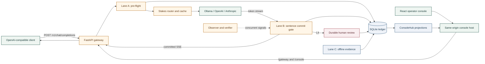
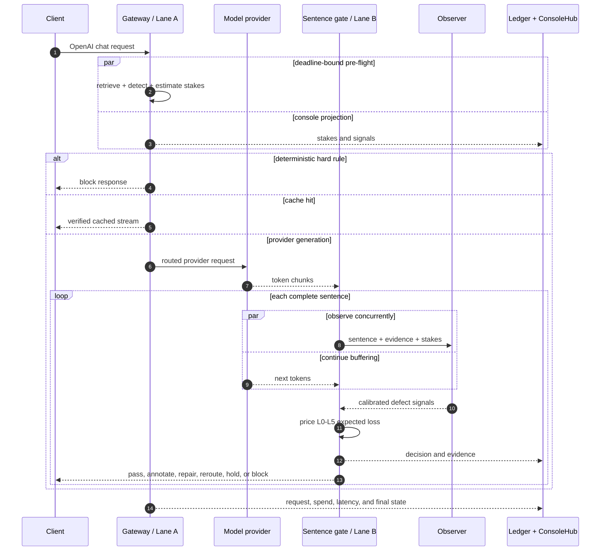
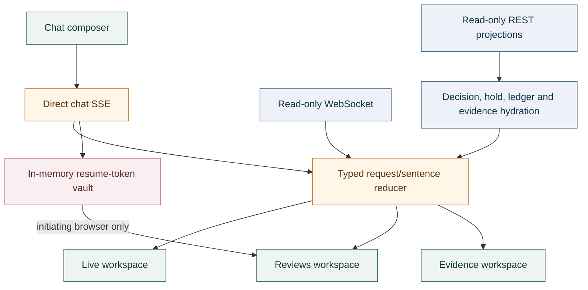

# Interlock

[](https://github.com/skb12356/Interlock-AI/actions/workflows/ci.yml)

**One stakes estimate. One routing decision. One guardrail budget.**

Interlock is an OpenAI-compatible AI control plane for high-consequence assistants. It
combines model routing and output safety into one economic decision: estimate how much a
request matters, price the expected loss of every available action, and choose the cheapest
safe rung before a person or tool acts on defective output.

The reference implementation is a retail-banking assistant with a Python/FastAPI gateway,
sentence-level streaming gate, durable SQLite ledger, offline evaluation lane, and a React
operator console. It runs locally against Ollama without an API key and also includes a
deterministic replay profile for UI development and demonstrations.

> [!IMPORTANT]
> Interlock is an evidence-oriented prototype, not a claim of production certification.
> The committed evaluation catches the seeded defects but still misses verification-cost,
> net-spend, and false-intervention targets. See [Known limitations](#known-limitations)
> before interpreting the metrics.

## Why Interlock exists

Most AI stacks route requests and guard responses in separate systems. Interlock treats
them as the same optimization problem:

1. Estimate request stakes in INR from domain, monetary amounts, reversibility, and role.
2. Calibrate defect probabilities from deterministic and observer signals.
3. Compute the expected loss of every intervention using the same policy inputs.
4. Route to an appropriate model tier and gate each sentence before release.
5. Record the decision, evidence, spend, latency, holds, and later offline observations.

The primary metric is **Pre-Action Catch Rate**: the fraction of defects stopped before a
reader sees them or a tool executes them. That differs from model accuracy because it
measures the complete control path.

## Solution architecture



### Three control lanes

| Lane | Runs | Responsibility | Critical path |
| --- | --- | --- | --- |
| **A — pre-flight** | Before the provider call | Retrieval, injection/PII/canary detection, stakes, hard rules, cache, model tier | Yes, deadline-bound |
| **B — in-flight** | Concurrent with generation | Sentence segmentation, observer/grounding signals, expected-loss decision, annotate/repair/reroute/hold/block | Hidden behind the next sentence where possible |
| **C — offline** | Sampled after requests | Shadow replay, fairness twins, anytime-valid e-values, drift, evaluation and calibration | No |

Lane A drops detectors that exceed their deadline instead of stalling the request. Lane B
streams one sentence behind the provider, which creates a commit point where unsafe text can
still be repaired or withheld. Lane C never changes a live response; it produces evidence
for later policy and model review.

### Request lifecycle



### Expected-loss ladder

The optimizer evaluates all six actions in the policy currency. It combines residual harm,
false-intervention nuisance, compute, and time cost; hard rules can make actions unavailable.

| Action | Meaning | Typical use |
| --- | --- | --- |
| `L0_pass` | Release the sentence unchanged | Low calibrated risk |
| `L1_annotate` | Add a deterministic qualification/citation | Mild uncertainty |
| `L2_repair` | Regenerate only the defective sentence with evidence | Localized factual defect |
| `L3_reroute` | Regenerate on the stronger tier | Weak-model or broad answer failure |
| `L4_hold` | Persist and wait for human review | High-risk reversible response/tool decision |
| `L5_block` | Emit no unsafe customer content | Deterministic prohibition or unacceptable loss |

The policy is code-reviewed YAML at [`policies/banking.yaml`](policies/banking.yaml). Each
decision records the policy/calibrator/probe versions, six-row loss table, runner-up, margin,
rationale, hard rule, input digest, and latency.

## Operator console

The React console explains decisions; it does not tune thresholds or bypass audited hold
routes.



- **Live** pairs the bank chat with stakes, signal probabilities, sentence timeline,
  L0-L5 rail, full expected-loss table, hard-rule/degraded state, and counterfactual output.
- **Reviews** shows durable response/tool holds, evidence, expiry/SLA state, reversibility,
  tool arguments, and approve/reject actions.
- **Evidence** shows calibration, confidence intervals, latency, action counts, ledger
  economics, and Lane C observations without inventing unavailable data.

Immediate output comes from `/gateway/v1/chat/completions`. Full history and persisted
details come from read-only projections:

| Interface | Purpose |
| --- | --- |
| `WS /console/ws` | Push-only, bounded process-lifetime event stream with reconnect replay |
| `GET /console/recent` | Cursor recovery using `stream_id` and monotonic `seq` |
| `GET /console/status` | Live/replay health and capability availability |
| `GET /console/decisions/{id}` | Persisted six-row loss table and rationale |
| `GET /console/holds` | Pending review cards with secrets removed |
| `GET /console/ledger/summary` | Traffic, spend, action, latency, regret/rework/net-value projection |
| `GET /console/lanec` | Fairness pair counts and anytime-valid e-value state |
| `GET /console/artifacts/{name}` | Explicitly allowlisted JSON evidence artifacts |

## Repository map

```text
interlock/
├── core/              Frozen types, IDs, money, policy and SSE contracts
├── gateway/           FastAPI proxy, providers, Lane A, router, cache and ConsoleHub
├── gate/              Sentence segmenter, commit gate, action ladder and repair
├── signals/           Injection, PII, canary, stakes, grounding and observer signals
├── risk/              Calibration, conformal filter and expected-loss engine
├── retrieval/         Corpus loading, chunking, hybrid retrieval and vector store
├── observer/          Probe/encoder/verifier interfaces and mock observer service
├── interlock_tools/   Provenance lattice, reversibility, tool holds and stream parsing
├── ledger/            SQLite writer, pricing, regret, rework and evidence packs
├── lanec/             Fairness twins, e-values, drift and deep-judge support
├── eval/              Seeded cases, induced defects, splits, metrics and harness
└── console/           Production static host and same-origin reverse proxy

console/               React 19 app, Vitest tests and Playwright journeys
policies/              Versioned policy-as-code
migrations/            Idempotent SQLite schema migrations
corpus/                Banking reference documents and poisoned/untrusted fixtures
artifacts/             Calibration, evaluation and measured-latency outputs
scripts/               Supervisor, replay, indexing, calibration, eval and rehearsal tools
Implementation/        Original build plan, architecture, contracts and ADRs
docs/                  Deployment runbook, contract index and limitations
coordination/          Person 1/Person 2 integration notes
```

## Dependencies

### Required tools

| Tool | Version/role |
| --- | --- |
| Python | **3.12** (`pyproject.toml` intentionally excludes 3.13) |
| [uv](https://docs.astral.sh/uv/) | Python environment, lockfile and command runner |
| Node.js | **22** recommended; Vite 7 requires Node 20.19+ or 22.12+ |
| npm | Installs the locked console dependencies |
| PowerShell (`pwsh`) | Native three-service supervisor used by `make up` / `scripts/up.ps1` |
| Ollama | Optional for live local generation; not needed for deterministic replay |

Docker is deliberately not part of this build. The native supervisor replaces Compose and
starts three localhost-bound processes with health checks.

### Python dependency tiers

- **Core runtime:** FastAPI/Uvicorn, HTTPX, Pydantic, PyYAML, OpenTelemetry, NumPy,
  scikit-learn, DuckDB, pysbd, and pyahocorasick.
- **Development:** pytest, pytest-asyncio, Hypothesis, respx, Ruff, mypy, pre-commit, the
  OpenAI SDK, and HTTPX test support.
- **Optional ML extra:** PyTorch, Transformers, Sentence Transformers, ONNX Runtime,
  Optimum, Presidio, sqlite-vec, and Matplotlib.

> [!NOTE]
> Baseline retrieval tests currently exercise `sqlite-vec`, while it is declared only in
> the `ml` extra. Until packaging is aligned, install `sqlite-vec==0.1.9` explicitly when
> using the light core/dev environment.

### Console stack

- React 19 and React DOM
- TypeScript 5.9 and Vite 7
- Recharts for evidence visualizations
- Vitest, Testing Library, jsdom, and Playwright

## Getting started

### 1. Clone and configure

```bash
git clone https://github.com/skb12356/Interlock-AI.git
cd Interlock-AI
cp .env.example .env
```

The defaults use local Ollama and hash prompts before ledger storage. Do not commit `.env`,
provider keys, tenant canaries, production ledgers, or hold resume tokens.

### 2. Install dependencies

For the complete local profile:

```bash
uv sync --group dev --extra ml
npm --prefix console ci
```

For the lighter deterministic replay and standard test profile:

```bash
uv sync --group dev
uv pip install sqlite-vec==0.1.9
npm --prefix console ci
```

### 3A. Run the deterministic console demo

This profile needs no model, provider key, corpus index, or observer weights. Run the two
commands in separate terminals:

```bash
uv run python scripts/replay_console.py --port 8099
```

```bash
npm --prefix console run dev -- --host 127.0.0.1
```

Open <http://127.0.0.1:5173>. The replay server provides four repeatable journeys:

- `clean` — L0 pass
- `scene1` — L2 sentence repair
- `held` — L4 durable review
- `blocked` — L5 with no assistant content

### 3B. Run the live local stack

Install and start Ollama, then make the two configured model tiers available:

```bash
ollama pull qwen3:4b
ollama pull qwen3:8b
uv run python scripts/build_index.py
```

Start the gateway, mock observer contract, and compiled console:

```powershell
./scripts/up.ps1 -MockObserver -TimeoutSeconds 120
```

On a shell with PowerShell available, `make up` invokes the same supervisor. It builds the
console on first start and exposes:

| Service | URL |
| --- | --- |
| Gateway | <http://127.0.0.1:8080> |
| Observer | <http://127.0.0.1:8081> |
| Console | <http://127.0.0.1:5173> |

Check health and stop the stack:

```bash
curl --fail http://127.0.0.1:8080/health
curl --fail http://127.0.0.1:5173/health
pwsh -NoProfile -File scripts/down.ps1
```

Logs are written beneath `logs/` by service.

### 3C. Start services manually

This is useful when debugging one process at a time:

```bash
# Terminal 1: observer contract
uv run uvicorn interlock.observer.mock_server:app --host 127.0.0.1 --port 8081

# Terminal 2: gateway
uv run uvicorn interlock.gateway.app:app --host 127.0.0.1 --port 8080

# Terminal 3: production same-origin console
npm --prefix console run build
INTERLOCK_GATEWAY_URL=http://127.0.0.1:8080 \
  uv run uvicorn interlock.console.app:app --host 127.0.0.1 --port 5173
```

For Vite live-gateway development instead of the compiled console host:

```bash
CONSOLE_BACKEND_URL=http://127.0.0.1:8080 \
  npm --prefix console run dev -- --host 127.0.0.1
```

## Use the API

Point any OpenAI-compatible client at the gateway:

```python
from openai import OpenAI

client = OpenAI(base_url="http://127.0.0.1:8080/v1", api_key="local")
response = client.chat.completions.create(
    model="interlock-auto",
    messages=[
        {"role": "user", "content": "Can I prepay my floating-rate home loan?"}
    ],
)
print(response.choices[0].message.content)
```

The gateway supports standard OpenAI `data:` chunks plus named SSE events for stakes,
signals, decisions, and holds. Clients that need those events can read the raw stream;
ordinary OpenAI clients continue to consume assistant content.

Key routes:

| Route | Description |
| --- | --- |
| `POST /v1/chat/completions` | OpenAI-compatible chat completion, streaming or buffered |
| `GET /v1/models` | Available Interlock/provider model view |
| `POST /v1/uploads` | Text/PDF extraction as explicitly untrusted fragments |
| `GET /v1/holds` | Pending durable holds |
| `POST /v1/holds/{id}/approve` | Resolve a hold; approval requires its resume token |
| `POST /v1/holds/{id}/reject` | Reject a hold without requiring the release secret |
| `GET /health` | Provider, observer, policy, calibration and retrieval health |
| `GET /admin/latency` | Gateway latency histogram |
| `GET /admin/governor` | Current degradation/governor state |
| `GET /admin/economics` | Ledger economics projection with provenance |
| `GET /admin/lanec` | Lane C evidence projection |
| `GET /admin/evidence/{request_id}.zip` | Request evidence pack |

> [!WARNING]
> Uploaded fragments participate in Interlock's risk/provenance analysis. Sending their
> extracted text onward as provider prompt context is intentionally deferred pending an
> explicit sensitive-data egress decision. Do not assume an uploaded document currently
> grounds the provider's generated answer.

## Configuration

Copy [`.env.example`](.env.example) and adjust only what the deployment needs.

| Variable | Default | Purpose |
| --- | --- | --- |
| `INTERLOCK_OLLAMA_BASE_URL` | `http://127.0.0.1:11434/v1` | Local OpenAI-compatible provider |
| `INTERLOCK_CHEAP_PROVIDER` / `INTERLOCK_CHEAP_MODEL` | `ollama` / `qwen3:4b` | Low-stakes tier |
| `INTERLOCK_STRONG_PROVIDER` / `INTERLOCK_STRONG_MODEL` | `ollama` / `qwen3:8b` | High-stakes tier |
| `OPENAI_API_KEY` / `ANTHROPIC_API_KEY` | unset | Optional hosted providers |
| `INTERLOCK_OBSERVER_URL` | `http://127.0.0.1:8081` | Lane B observer service |
| `INTERLOCK_LANE_A_DEADLINE_MS` | `120` | Pre-flight detector deadline |
| `INTERLOCK_OBSERVE_DEADLINE_MS` | `800` | Per-sentence observer budget |
| `INTERLOCK_SENTENCE_WATCHDOG_S` | `8` | Flush stalled partial sentences |
| `INTERLOCK_DB_PATH` | `data/interlock.db` | Append-oriented ledger |
| `INTERLOCK_CORPUS_INDEX_PATH` | `data/corpus.db` | Read-only retrieval index |
| `INTERLOCK_POLICY_PATH` | `policies/banking.yaml` | Versioned governance policy |
| `INTERLOCK_RISK_ENGINE` | `real` | `real` for traffic; `stub` only for tests/rehearsal |
| `INTERLOCK_CONFORMAL_FILTER` | `0` | Optional guaranteed mode; costly at current threshold |
| `INTERLOCK_VERIFIER` | `0` | Enable the heavier claim verifier |
| `INTERLOCK_STORE_PROMPTS` | `0` | Store raw prompts instead of hashes |
| `INTERLOCK_GATEWAY_URL` | `http://127.0.0.1:8080` | Console host's gateway upstream |
| `CONSOLE_BACKEND_URL` | `http://127.0.0.1:8099` | Vite development proxy target |

## Evaluation and evidence

The repository keeps claims attached to generated artifacts rather than README snapshots:

```bash
uv run python scripts/calibrate.py
uv run python scripts/eval.py --json artifacts/eval/report.json
uv run python scripts/eval.py --conformal-filter \
  --json artifacts/eval/report-guaranteed.json
uv run python scripts/sensitivity.py
uv run python scripts/measure_action_latency.py
```

The console only serves an explicit artifact allowlist. Confidence intervals remain next to
their estimates, replay evidence is labelled, and an empty ledger reports unavailable or
zero-observation state rather than fabricated economics.

Two results must always be read together:

- The seeded set reports a high Pre-Action Catch Rate **and** a false-intervention miss.
- The conformal artifact reports zero certified ungrounded escapes **and** a 100%
  intervention rate at the selected threshold.

See [`artifacts/eval/report.json`](artifacts/eval/report.json),
[`artifacts/calibration/lambda.json`](artifacts/calibration/lambda.json), and
[`docs/LIMITATIONS.md`](docs/LIMITATIONS.md) for the committed evidence and caveats.

## Testing and quality gates

The implementation uses contract tests for frozen seams, property tests for the sentence
commit gate, unit/HTTP tests for the Python services, Vitest for the reducer/UI, and
Playwright for all four replay journeys at desktop and mobile viewports.

Run the complete non-network gate:

```bash
uv run ruff check .
uv run ruff format --check .
uv run mypy --strict interlock/core interlock/retrieval interlock/interlock_tools
uv run pytest -q --ignore=tests/chaos -m "not slow" tests console/tests/python

npm --prefix console run test:unit -- --run
npm --prefix console run typecheck
npm --prefix console run build
npm --prefix console run test:e2e
```

Slow verifier/probe tests require the cached or downloadable
`cross-encoder/nli-distilroberta-base` weights. The deterministic replay tests do not.

## Security and privacy model

- The gateway, observer, and console bind to localhost in the supplied runbook. Put TLS,
  authentication, tenant authorization, rate limits, and request-size enforcement at the
  deployment edge before exposing them beyond a trusted host.
- Prompts are hashed by default. Raw storage requires `INTERLOCK_STORE_PROMPTS=1` and an
  explicit deployment decision.
- Retrieved/uploaded content is conservatively labelled untrusted and flows through the
  provenance lattice.
- Hold resume tokens appear only in the initiating browser's SSE event, live only in an
  in-memory vault, and are recursively removed from console projections and diagnostics.
- Approval needs the secret token; rejection remains possible without it so losing a secret
  can never force execution.
- Evidence artifact paths are allowlisted and resolved beneath the artifact root.
- The React console does not render raw HTML and never stores secrets in browser storage,
  URLs, logs, or rendered state.
- Policy thresholds and action prices are reviewable files, not console controls.

## Deployment shape

The supported production shape is a single VM/process group behind a TLS reverse proxy:

```text
Browser ──TLS──> reverse proxy ──> console host :5173
                                   ├── static React assets
                                   ├── /gateway/* ──> gateway :8080
                                   └── /console/* ──> gateway :8080
Gateway :8080 ──> observer :8081
              ├──> configured model providers
              ├──> read-only corpus index
              └──> append-oriented ledger
```

Keep the browser on the console origin; do not expose a second browser-facing gateway
origin. The console proxy preserves streaming responses and WebSocket upgrades. Refer to
[`docs/05_deploy_runbook.md`](docs/05_deploy_runbook.md) for rehearsal, health, load, and
rollback procedures.

## Known limitations

- The banking policy, corpus, calibrator, and evaluation set do not generalize to other
  verticals without rebuilding their evidence.
- False interventions remain well above target on high-stakes traffic because the current
  impact model prices the full request impact at each sentence.
- The committed efficacy matrix is partly policy-backed rather than entirely re-measured
  from forced live outcomes.
- The default dense retrieval arm is a deterministic hashed vector; BM25 carries much of
  the current retrieval quality.
- Calibration data is induced rather than a completed 300-item human anchor set.
- The real observer weights are optional; a clean CPU-only checkout runs deterministic
  signals and reports missing probe capability.
- Lane C endpoints are implemented, but a fresh ledger has no production fairness pairs.
- PDF upload extraction handles conservative printable text, not arbitrary layout, OCR, or
  encrypted documents.
- Provider-bound use of uploaded text is deferred pending explicit sensitive-data egress
  authorization.
- The last local integration rehearsal used a deterministic OpenAI-compatible fixture
  because Ollama was unavailable; this validates control flow, not live-model quality.

The authoritative, current list is [`docs/LIMITATIONS.md`](docs/LIMITATIONS.md).

## Design and implementation documents

| Document | Purpose |
| --- | --- |
| [`Interlock-v2.pdf`](Interlock-v2.pdf) | Product rationale, evidence base and target outcomes |
| [`Implementation/Implementation01.md`](Implementation/Implementation01.md) | Delivery plan and sequencing |
| [`Implementation/Implementation02.md`](Implementation/Implementation02.md) | Detailed system design |
| [`Implementation/Implementation03.md`](Implementation/Implementation03.md) | Five frozen interface contracts |
| [`Implementation/Implementation04.md`](Implementation/Implementation04.md) | Architecture decision records |
| [`IMPLEMENTATION_STATUS.md`](IMPLEMENTATION_STATUS.md) | Built/measured/stubbed/deviation ledger |
| [`coordination/PERSON2_NOTES.md`](coordination/PERSON2_NOTES.md) | Console design and backend integration handoff |
| [`docs/05_deploy_runbook.md`](docs/05_deploy_runbook.md) | Local, rehearsal and single-VM operations |
| [`docs/LIMITATIONS.md`](docs/LIMITATIONS.md) | Release misses and claim boundaries |
| [`docs/contracts/README.md`](docs/contracts/README.md) | Contract index |

## Guiding principle

Interlock does not hide judgement behind a single opaque safety threshold. Stakes,
probabilities, action efficacy, nuisance, compute, latency, hard rules, policy versions,
confidence intervals, and unavailable evidence are all made inspectable. The goal is not
to promise that an AI system is safe; it is to make every consequential control decision
auditable before anyone acts on it.
