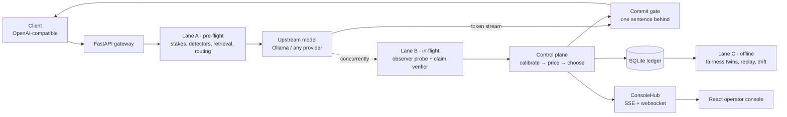

# Interlock — architecture and the maths behind it

This document explains what Interlock does to a single request, in order, with the actual
formulas and the published work each one comes from. It is written to be read top to
bottom: the short version lives in the [README](../README.md), and everything below is the
detail that sits under it.

Every number quoted as a *result* comes from a committed artifact under `artifacts/`.
Numbers quoted as *policy* come from [`policies/banking.yaml`](../policies/banking.yaml),
which is a reviewed, versioned file rather than a constant in code — the current version is
`banking-v4`, and its id is stamped on every decision.

---

## Contents

1. [The shape of the system](#1-the-shape-of-the-system)
2. [Lane A — before the model runs](#2-lane-a--before-the-model-runs)
3. [Retrieval](#3-retrieval)
4. [Routing](#4-routing)
5. [Lane B — while the model is talking](#5-lane-b--while-the-model-is-talking)
6. [From scores to probabilities: calibration](#6-from-scores-to-probabilities-calibration)
7. [From probabilities to a promise: conformal risk control](#7-from-probabilities-to-a-promise-conformal-risk-control)
8. [The decision: expected loss in one currency](#8-the-decision-expected-loss-in-one-currency)
9. [The commit gate](#9-the-commit-gate)
10. [The tool interlock](#10-the-tool-interlock)
11. [Lane C — after the customer has their answer](#11-lane-c--after-the-customer-has-their-answer)
12. [The ledger](#12-the-ledger)
13. [What the console shows](#13-what-the-console-shows)
14. [Failure behaviour](#14-failure-behaviour)
15. [Honest limits](#15-honest-limits)

---

## 1. The shape of the system

Interlock is an OpenAI-compatible proxy. A client points `base_url` at it and keeps using
the same request shape; the model behind it is unmodified and does not know Interlock is
there.



Three lanes, and only two of them can ever make the user wait:

| Lane | When it runs | Latency budget | May it block a response? |
|---|---|---|---|
| **A — pre-flight** | before the upstream call | tens of ms | yes, and it is the only lane that can stop a request before any money is spent |
| **B — in-flight** | concurrently with generation | hidden behind the one-sentence buffer | yes, at the sentence boundary |
| **C — offline** | after the answer is delivered | none | no, ever |

The lane split is the design's load-bearing constraint: verification that runs *after*
generation adds its full cost to the user's wait, while verification that runs *during*
generation is nearly free. The published measurement Interlock follows here is SentGuard's
waiting-buffer framework, reported at 36 ms added overhead against 576 ms for the blocking
equivalent.

---

## 2. Lane A — before the model runs

### 2.1 The stakes estimate

Everything downstream is scaled by one number: what it would cost if this particular
answer is wrong. It is computed from the request, not from a per-tenant slider.

```
impact_inr  =  base_impact(domain)
             × monetary_multiplier(largest amount in the text)
             × role_multiplier(who is asking)
```

with `reversibility ∈ {reversible, costly, irreversible}` carried alongside it, from the
domain entry. From `policies/banking.yaml`:

| Domain | Base impact | Reversibility |
|---|---:|---|
| `loan_terms`, `prepayment` | ₹40,000 | costly |
| `payments` | ₹25,000 | irreversible |
| `claims` | ₹12,000 | costly |
| `fees` | ₹3,000 | costly |
| `general` | ₹200 | reversible |
| `branch_info` | ₹50 | reversible |
| *(no domain matched)* | ₹200 | reversible |

`largest_amount_inr` parses `₹40,000`, `Rs. 40,000`, `INR 1,85,000` and `40000 rupees`, and
takes the maximum found in the user's message. The multiplier bands are in the policy, so a
reviewer changes a YAML table rather than a regex.

The estimate is produced once and used twice — by the router and by the guardrail. That
sharing is the project's central claim, and it is why the oversight is not a separate tax:
the money saved by not over-routing cheap questions is the money that pays for checking the
expensive ones.

### 2.2 Deterministic detectors

Three checks run before the model, and all three are rules rather than models, because a
rule cannot be argued out of its answer:

- **Injection** — pattern set plus a classifier over the user turn and retrieved chunks.
- **PII** — redaction before retrieval, so identifiers are not embedded in a search index.
- **Canary** — a per-tenant token planted in the system prompt and in the corpus. If it
  ever appears on egress, that is a *certainty*, not a probability: the response is stopped
  at L5 with no model in the loop. This is the canary-token mitigation OWASP references for
  system-prompt leakage.

Design rule, stated in `CLAUDE.md` and followed here: where a deterministic check exists,
use it instead of a model.

---

## 3. Retrieval

Grounding needs something to be grounded *in*. The store is SQLite with two arms:

- **Lexical** — BM25 over an FTS5 index. BM25 scores a document `D` for query `Q` as

  ```
  score(D, Q) = Σ_i  IDF(q_i) ·  f(q_i, D) · (k₁ + 1)
                            ─────────────────────────────────────
                            f(q_i, D) + k₁ · (1 − b + b · |D|/avgdl)
  ```

  the standard probabilistic-relevance formulation (Robertson & Zaragoza, 2009), evaluated
  by SQLite's `bm25()`.

- **Dense** — a vector arm behind the same interface. In this build the dense arm is a
  lexical stand-in rather than a trained sentence encoder, and it is labelled as such
  (deviation D-009); the fusion weights it at `0.5` for exactly that reason.

The two ranked lists are combined with **reciprocal rank fusion**:

```
RRF(d) = Σ_arms  w_arm / (k + rank_arm(d) + 1),      k = 60
```

RRF is used rather than a score-weighted blend because it reads only ranks, so it does not
need re-tuning every time either arm changes its score scale.

Each retrieved fragment carries provenance — `retrieved_verified` or
`retrieved_untrusted` — and that label survives all the way to the tool interlock.

---

## 4. Routing

The router picks the model tier **before** paying anyone, which is the finding from
RouteLLM: a pre-generation decision beats a try-cheap-then-escalate cascade, because a
cascade pays the small model even on the queries it ends up escalating anyway.

The rule is stakes-first:

```
if impact_inr ≥ thresholds.strong_model_above_impact_inr (₹1,000):
        → strong tier, reason = "stakes"          # difficulty cannot override this
else:
        → strong tier if difficulty ≥ 0.5, else small tier
```

`difficulty` is a deterministic heuristic — multi-hop phrasing, arithmetic, comparison,
long context — combined with `max`, not a mean, because difficulty is a bottleneck rather
than an average. It is labelled `difficulty_heuristic-v1` in the trace and **not** claimed
to be RouteLLM's trained matrix-factorisation controller, which would need preference data
this build does not have.

The semantic cache serves an answer only when four conditions hold together: cosine ≥ 0.95,
the retrieval-context hash matches, stakes are below the cache threshold, and the cached
answer previously passed verification. The context hash is what stops a superseded clause
being served forever.

---

## 5. Lane B — while the model is talking

### 5.1 The observer probe

A separate small model reads the `(context, question, candidate answer)` triple and a
**linear probe** on its residual stream scores the likelihood of hallucination from a
single forward pass.

```
score = σ(wᵀ h_ℓ + b)
```

where `h_ℓ` is the residual stream at layer `ℓ`. One probe is fitted per layer and the
layer is chosen by **held-out** AUROC, never training AUROC — with 768 features and a few
thousand examples, choosing by training score reliably selects the layer that overfits
hardest.

Three published results stack here:

- Semantic entropy (Farquhar et al., *Nature* 630, 2024) is the strongest signal, but needs
  ~10 samples per question, so Interlock uses it **offline as a label generator only**.
- Semantic Entropy Probes (Kossen et al., arXiv:2406.15927) show that the same quantity is
  recoverable from hidden states of a *single* generation — that is what makes it affordable
  on 100% of traffic.
- The observer being a *different* model from the generator (O'Neill et al.,
  arXiv:2507.23221) is what keeps Interlock model-agnostic: no access to the generator's
  internals is required, so it works in front of a closed API.

Keeping the head linear is deliberate. A non-linear head on top of an encoder is simply a
second model, and would need its own calibration, its own drift monitoring and its own
defence.

### 5.2 Claim-level grounding

The answer is split into claims and each claim is checked against what was actually
retrieved, using a MiniCheck-class cross-encoder (Tang, Laban & Durrett, EMNLP 2024 —
a 770M model reaching GPT-4-level fact-checking at a fraction of the cost).

The verifier returns a label **and the offending span**. The span is not a nicety: L2
repair regenerates one sentence, and without a span there is nothing to aim at.

Implementation detail worth recording: the entailment class is found **by name**, not by
index. The checkpoint in use orders its labels `{0: contradiction, 1: entailment, 2:
neutral}`, so a hard-coded index 2 would have scored *neutral* as entailment.

### 5.3 Deterministic grounding signals

Six cheap signals run alongside, each returning a raw score in `[0, 1]` where higher is
more suspicious. None of them is a probability until §6 says so.

| Signal | What it measures |
|---|---|
| `unsupported_content` | content words in the answer with no support in the retrieved text |
| `numeric_unsupported` | figures in the answer that appear in no retrieved fragment |
| `citation_unsupported` | a cited clause or document nobody retrieved — the most checkable lie in the corpus |
| `context_conflict` | retrieved fragments that contradict each other |
| `question_drift` | an answer that has wandered off the question |
| `overconfidence` | how certain the answer *sounds* against how certain it should be |

Stop-words are excluded from the overlap counts: "the of a to" is shared by every pair of
sentences in the corpus, and counting that as support inflates every score toward safe.

The last one has its own literature — verbal uncertainty is a largely separate linear
feature from semantic uncertainty, and the *mismatch* between them predicts hallucination
better than semantic uncertainty alone (Ji et al., arXiv:2503.14477).

The measured per-signal discrimination on the 10,000-item calibration set
(`artifacts/calibration/report.json`) is published as-is, including the three signals that
are close to chance:

| Signal | AUROC |
|---|---:|
| `unsupported_content` | 0.836 |
| `numeric_unsupported` | 0.795 |
| `citation_unsupported` | 0.600 |
| `context_conflict` | 0.575 |
| `question_drift` | 0.536 |
| `overconfidence` | 0.504 |

---

## 6. From scores to probabilities: calibration

A detector score is not a probability, and pricing an action in rupees with an uncalibrated
score produces arithmetic that looks rigorous and is not. Two steps fix it.

**Step 1 — per-signal isotonic regression.** For each signal, fit a monotone map
`g: score → probability` that minimises squared error subject to being non-decreasing:

```
min_g  Σ_i ( g(s_i) − y_i )²      subject to   s_i ≤ s_j  ⇒  g(s_i) ≤ g(s_j)
```

Monotone means the ordering the detector produces is preserved — only the *values* are
corrected. This is the classical result of Zadrozny & Elkan (2002) on turning classifier
scores into usable probability estimates.

**Step 2 — logistic fusion.** The calibrated signals are combined:

```
P(defect) = σ( β₀ + Σ_k β_k · g_k(s_k) )
```

Both steps are fitted with 5-fold stratified cross-validation, and every reported number is
**out-of-fold**. Fitting and scoring on the same data drives ECE toward zero no matter how
bad the model is; isotonic regression is especially good at that particular self-deception.

Measured on 10,000 items with 1,000 positives:

| Metric | Value | What it means |
|---|---:|---|
| ECE | 0.0037 | mean gap between predicted and observed frequency |
| Brier | 0.0207 | squared error of the probability itself |
| AUROC | 0.909 | ranking quality of the fused probability |

`P(any)` is combined across defect classes with a noisy-OR, i.e. `1 − Π_d (1 − P(d))`.

---

## 7. From probabilities to a promise: conformal risk control

Calibration says *how likely*. It does not, on its own, license a sentence like "at most 1%
of shipped answers are ungrounded".

The naive route — sweep thresholds on held-out data, keep the best one, quote its empirical
rate — is multiple testing. The winner is partly lucky, and the quoted rate is optimistic by
an amount nobody can state, which is worse than having no bound at all because it looks
like one.

Interlock uses **Learn-then-Test** (`interlock/risk/conformal.py`), following the
risk-control formulation of Angelopoulos et al.:

1. Each candidate threshold `λ` is a hypothesis: *"the true escape rate at λ exceeds α."*
2. Compute a valid p-value per hypothesis from held-out data using a concentration
   inequality — the **minimum of Hoeffding's bound and Bentkus's binomial-tail bound**.
   Taking the minimum of two valid bounds is itself valid, and Bentkus is far tighter in the
   rare-event regime this operates in, where a normal approximation is least trustworthy.
3. Control the family-wise error with **fixed-sequence testing**: order thresholds from most
   to least conservative and walk until the first non-rejection. The ordering carries
   information — a stricter threshold cannot have a higher escape rate — so unlike Bonferroni
   over an unordered family, this spends no correction budget at all.

Committed result (`artifacts/calibration/lambda.json`), at `α = 0.01`, `δ = 0.10`,
`n = 840`:

```
λ = 0.015 → escape rate 0.0, intervention rate 1.00, p = 0.00059  (rejected ⇒ certified)
λ = 0.020 → escape rate 0.199, intervention rate 0.067, p = 1.0   (not rejected)
```

The bound holds — and the certified threshold intervenes on **100% of traffic**, which the
artifact says in its own notes. That is the honest reading: the guarantee is real and, at
this detector quality, operationally expensive. Which is why the conformal filter is *off*
by default and `make eval-guaranteed` runs it on, so both numbers stay visible.

---

## 8. The decision: expected loss in one currency

Every rung of the ladder is priced in rupees, and the cheapest available one wins.

```
E[L(a)] =  Σ_d  P(d) · Impact_d · (1 − eff[a][d])        (1) harm that survives the action
        +  (1 − P(any)) · Nuisance(a)                    (2) the cost of a false alarm
        +  tokens(a) · price + human_cost(a)             (3) compute, and a reviewer's time
        +  λ_time · Δlatency(a) / 1000                   (4) the user's time, priced
```

**Impact is derived, never typed in:**

```
Impact_d = impact_inr × defect_multiplier[d] × reversibility_multiplier[reversibility]
```

| Reversibility | × |  | Defect class | × |
|---|---:|---|---|---:|
| reversible | 1.0 | | ungrounded | 1.0 |
| costly | 2.5 | | overconfident | 1.2 |
| irreversible | 8.0 | | contradicted | 1.4 |
| | | | unsafe_action | 3.0 |
| | | | pii_leak | 6.0 |
| | | | canary_leak | 10.0 |

`λ_time = ₹0.40` per second of customer waiting; `price = ₹0.60` per 1k tokens;
`human_review.cost_inr = ₹220`. Human cost is charged **unconditionally** on L4 and L5, not
weighted by `1 − P(any)`: the reviewer is paid whether or not the answer turns out to have
been fine. Charging it through the false-alarm term instead made holding cost ₹22 rather
than ₹220 at `P = 0.9` — that is, it made holding look nearly free at exactly the moment it
was most likely to be chosen. L5 carries it too, because a blocked customer still needs
their question answered by somebody; charging it on hold but not on block would make
refusing cheaper than deferring, which is backwards.

**Term (2) is the term that stops over-blocking**, and over-blocking is what gets guardrails
switched off in week two.

**Hard constraints run before the argmin.** Deterministic rules (canary match, tool policy)
short-circuit to L4/L5 with no model in the loop; the optimiser then picks the cheapest
action among those that remain. That is the difference between "a number picked the action"
and "a number picked the cheapest action that still meets the guarantee".

**The whole table is always returned**, including rows that could not be chosen and the
reason — `already_emitted` makes L2/L3/L5 unavailable, because you cannot un-say a sentence
the reader has already seen. The table *is* the explanation, which is what the console
renders.

The intellectual ancestry of the ladder is the **reject option** in selective classification
(Geifman & El-Yaniv, 2017): trade coverage against error, rather than answering everything.
Interlock's addition is that the trade is priced in money instead of tuned against a
coverage curve, and that "escalate to a stronger model" and "escalate to a human" sit on the
same axis (the framing in *Cascaded Language Models for Cost-Effective Human–AI
Decision-Making*, NeurIPS 2025).

### 8.1 The measured release adjustment (finding F-019)

The seeded evaluation surfaced a real problem: at ₹40,000 impact with a 2.5× reversibility
multiplier, `L0_pass` only wins if `P(defect) < ~0.0001`, while the detector's floor on
clean text is ~0.02. So *nothing* passed above ₹10,000 — the objective working exactly as
specified, on an impact model that was too aggressive.

The `banking-v4` `decision_adjustment` block is the measured response, selected from 216
bounded candidates over three immutable seeds:

```yaml
decision_adjustment:
  impact_scale: 1.0            # do not scale harm down
  probability_deadband: 0.015  # subtract the detector's clean-text floor before pricing
  nuisance_multiplier: 20.0    # price a needless intervention closer to what it costs
```

It cut worst-seed disruptive false intervention from 92.36% to 64.97% while preserving 100%
pre-action catch and zero grounding escapes. **The 2% target is still missed**, and it is
recorded as an open finding rather than smoothed over. Hard rules execute independently and
cannot be weakened by this block.

---

## 9. The commit gate

Live television runs on a delay so a producer can catch a problem before it airs. The gate
is the same idea at sentence granularity: the reader is always looking at sentence *n* while
sentence *n+1* is being checked.

```
PASSTHROUGH ──escalate──► BUFFERING ──decision──► HOLDING ──► REPAIRING ──► TERMINATED
```

- Low-stakes traffic streams **unbuffered** — byte-identical to the provider's own stream.
- Buffered traffic holds exactly one sentence. That is the entire added latency on the
  release path.
- An 8-second per-sentence watchdog flushes rather than hangs if the model stalls mid
  sentence.
- Escalation is one-way, and `already_emitted` is tracked accurately, because the set of
  available actions depends on it.
- If the risk engine raises or times out, the gate **fails open on low stakes and closed on
  high stakes**. Holding a sentence because our own checker stalled is the worst outcome on
  cheap traffic; releasing an unchecked sentence is the worst outcome on expensive traffic.

---

## 10. The tool interlock

Tool calls are gated on what the action *does*, not on what the text says.

Three questions decide, in order:

1. **What does it do?** — money movement, outbound mail, deletion, external write.
2. **Is it reversible?** — the reversibility multiplier is already in the impact term, so an
   irreversible action is priced 8× a reversible one before any argument about wording.
3. **Where did the instruction come from?** — provenance. An instruction that traces to
   `retrieved_untrusted` content rather than the user turn cannot authorise an irreversible
   action.

When those combine badly, the call **freezes into a durable pending hold** that survives a
process restart, and a human resolves it with a resume token that is never persisted in the
projection.

This is the CaMeL design (Debenedetti et al., *Defeating Prompt Injections by Design*,
arXiv:2503.18813): separate trusted control flow from untrusted data flow and enforce
capabilities *outside* the language model, so a persuasive prompt cannot talk its way past
the check. **Interlock implements a simplified heuristic, not a CaMeL-complete interpreter**
— the enforcement point is gateway middleware priced by reversibility, and that difference
is stated rather than glossed.

---

## 11. Lane C — after the customer has their answer

Nothing in this lane can delay a response.

- **Counterfactual fairness twins** — the same request with protected attributes varied,
  compared decision-for-decision (the design of Tamkin et al., arXiv:2312.03689, run on
  sampled real traffic rather than synthetic scenarios).
- **Anytime-valid monitoring** — fairness is watched continuously, and continuous watching
  with ordinary significance tests manufactures false alarms. Interlock uses e-values, whose
  validity survives optional stopping (Koolen & Grünwald, 2022; the always-valid inference
  line of Johari et al., 2022), in the spirit of runtime fairness monitoring
  (Henzinger et al., 2023).
- **Shadow replay** — a sample of traffic re-run on a cheaper model and scored, which is
  what turns "what we spent" into "what we wasted".
- **Deep-judge anchor** — ~1% of traffic sampled for an offline generative judge, used only
  as a calibration anchor. A generative judge is never on the hot path.

---

## 12. The ledger

One transaction per request in SQLite, holding the decision, its evidence, spend, latency
and any hold. On top of it:

- **Cost-regret** — capability the request never needed, from the shadow replay.
- **Rework attribution** — retries, regenerations and human escalations charged back to the
  answer that caused them.
- **Net value** — with a confidence interval, and reported as *unavailable* rather than as
  zero when there are no observations to compute it from.

---

## 13. What the console shows

The console explains decisions that have already been made. It never renders a gauge and
waits for a human to pick a threshold.

Four SSE events carry a trace, and they are a frozen contract (`interlock/core/sse.py`):

| Event | Payload |
|---|---|
| `interlock.stakes` | impact, reversibility, domain, gate mode, route reason, model served |
| `interlock.signal` | sentence index, signal name, calibrated probability |
| `interlock.decision` | action, chosen loss, runner-up, margin, counterfactual, hard rule |
| `interlock.hold` | hold id, kind, reason, tool, sentence index |

The loss table is fetched per decision, which is how the console can show all six priced
rungs rather than only the winner.

---

## 14. Failure behaviour

| Failure | Behaviour |
|---|---|
| Risk engine raises | returns `L0_pass` with `why=["degraded: …"]`; never propagates |
| Deadline pressure | drops the verifier, prices with probe-only probabilities, marks the decision `degraded` |
| Load governor | thins background analysis first, then live-check depth; low stakes then pass, high stakes then hold |
| Model stalls mid-sentence | 8-second watchdog flushes the buffer |
| Observer unavailable | deterministic signals still price the decision; the trace says the probe is missing |

---

## 15. Honest limits

- The dense retrieval arm is a lexical stand-in, not a trained encoder (D-009).
- The router is a deterministic difficulty heuristic, not RouteLLM's trained controller.
- Calibration is fitted on induced failures rather than human labels (D-010).
- The certified conformal threshold intervenes on 100% of traffic.
- False interventions remain above target; the number is published rather than hidden.
- Verification cost and net spend are **modelled** from policy token prices and measured
  action latencies, not observed billing.

The full list, with measurements, is in [`docs/LIMITATIONS.md`](LIMITATIONS.md) and
[`IMPLEMENTATION_STATUS.md`](../IMPLEMENTATION_STATUS.md).

---

## References

Full citations, and what each one is used for, are in the
[Research foundations](../README.md#research-foundations) section of the README.
